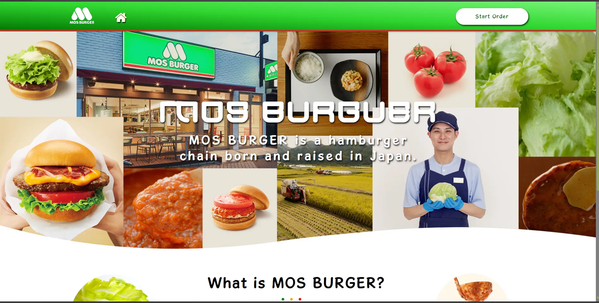
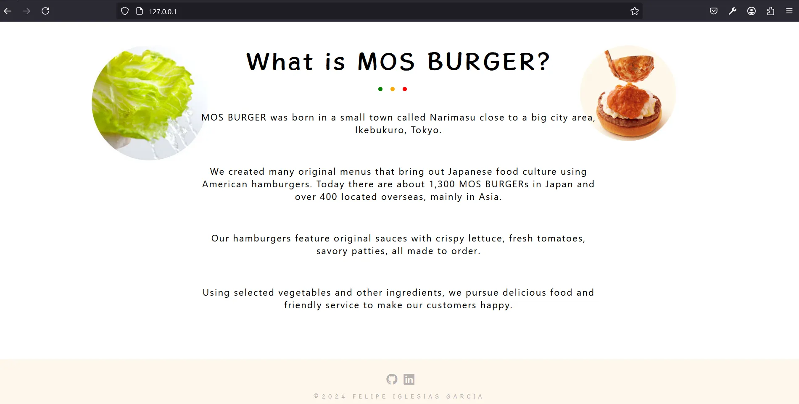
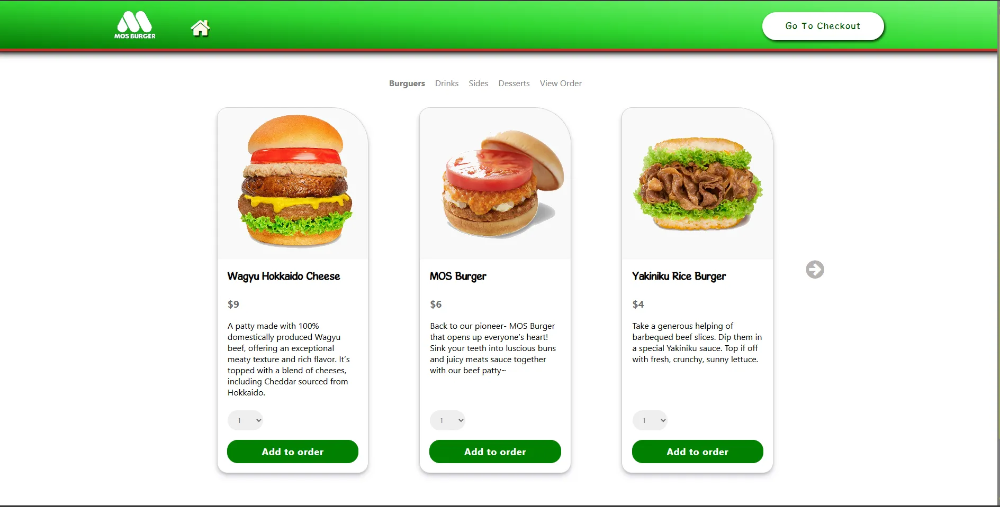
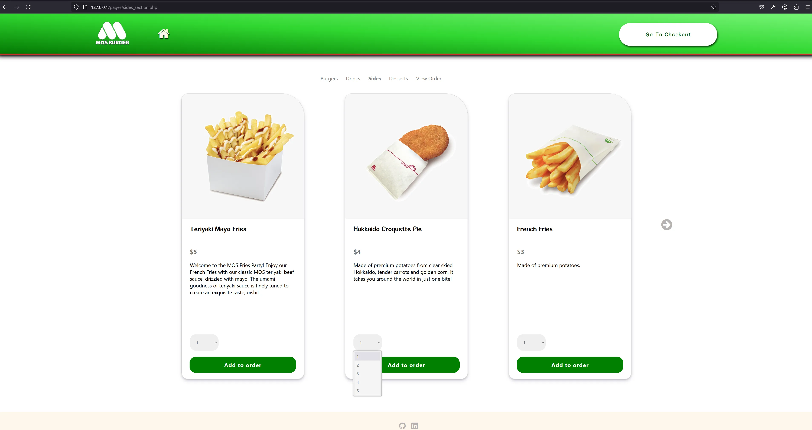
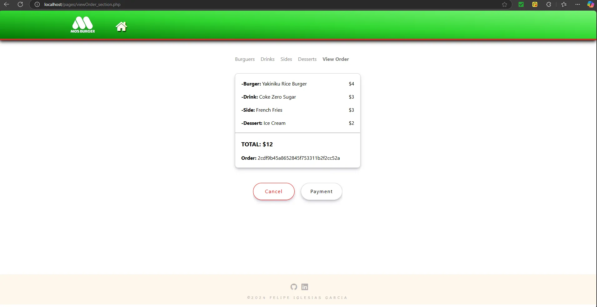
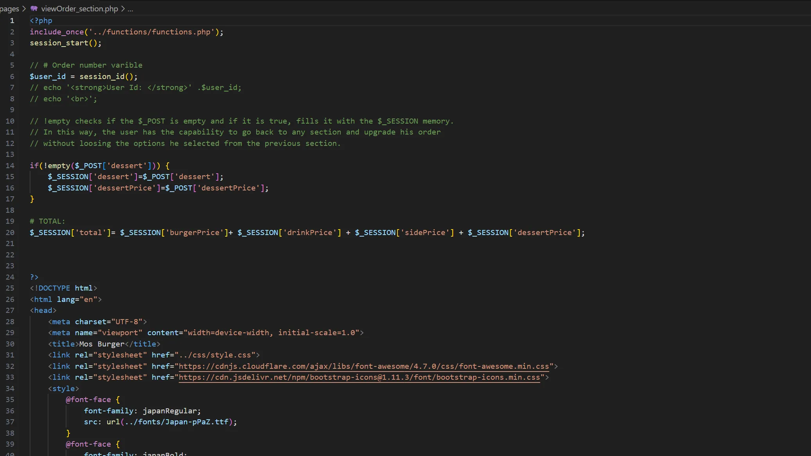

## 📄 Description

🍟🍔This is a project built with PHP in which I made a new website version of the iconic Japanese fast food restaurant MOS Burger.
The user can make an order and personalise the menu with burgers, sides, drinks, and desserts. I used the SESSION memory to hold the data.
Moreover, the users can go back to a previous section without losing the information of the ticket by handling the session memory with control programming.
At the end, the users can see the final order as the code of their ticket is their session ID. 🍟🍔

* No frameworks
* Local content
* No AI code 🚫🤖

*The website is optimized for a 15.6" 1920 x 1080 display with a 16:9 aspect ratio.

## 📷 Screenshots

### index.php

### burguers_section.php

### sides_section.php

### viewOrder_section.php

♦️ You may need a local server and import the database to display the website on your browser. 

## 📒 How to run a local server

You can use MAMP or XAMPP as free options:

https://www.mamp.info/en/windows/

https://www.apachefriends.org/

MAMP EXAMPLE (XAMPP works in the same way):

If you followed the default installation parameters, the directory to run the local server should be on this path: 

   C:\MAMP

Steps to start the server:

1. Start the server by running the <strong>MAMP.exe</strong> file. Next, initiate the Apache Server and MySQL Server if they don't do it automatically

2. At the same directory level where MAMP.exe is located, look for the <strong>htdocs</strong> folder and delete it.

3. Replace the removed <strong>htdocs</strong> folder for the one on this project.

4. In your browser type the following URL: 

   127.0.0.1/

  

